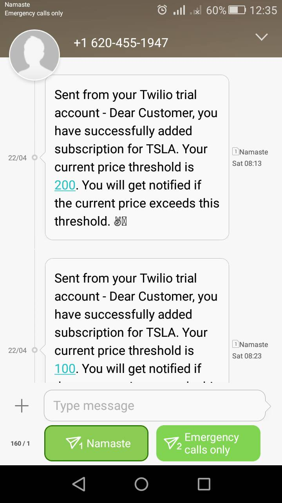

## STOCK PRICE NOTIFIER
This is a simple project where user can enter stock ticker symbol and set a threshold for stock price and then get notified in email/SMS when the stock price exceeds the user set threshold. This is a challenge project for data engineering.

## Developed By:
**Anish Shilpakar**

## Features
- User can subscribe to any stock ticker symbol and set desired price threshold
- User can choose options for email notification or SMS notification
- User can set frequency to minutely, hourly, daily
- More features to be added soon

## Tools Used
- Python
- Flask
- yfinance
- Twilio

## Demo Video


https://user-images.githubusercontent.com/43902648/233772114-beb452c7-b005-41ab-8ada-c50282de1aee.mp4

## Screenshots
### Home Page

### Subscription Added Page 

### Email Notifications


### Mobile Notifications



## Project Directory Structure
- controllers => controller file
- models => code for connecting to database and utlities function
- routes => routes file
- screenshots => screenshots for readme
- static => css file
- templates => html files
- main.py => main python file
- database.db => sqlite database
- Description.md => Task description
- challenge1_documentation.pdf => Project Documentation

## Steps to setup this project
1. Clone this repo.
```
git clone https://github.com/JuJu2181/Stock-Price-Notifier
```
2. Install requirements
```
pip install -r requirements.txt
```
> Use Python 3.8.10 and installing requirements in virtual environment is recommended
3. Create env file using .env_example and add your details
```
RAPID_API_KEY=YOUR_API_KEY
RAPID_API_HOST=YOUR_API_HOST
SENDER_MAIL=YOUR_EMAIL_ADDRESS
SENDER_PWD=YOUR_APP_PASSWORD
TWILIO_ACCOUNT_SID=YOUR_TWILIO_SID
TWILIO_AUTH_TOKEN=YOUR_TWILIO_AUTH_TOKEN
TWILIO_PHONE_NUMBER=YOUR_TWILIO_PHONE_NUMBER
```
4. Start the App
```
python main.py
```

Feel free to contact me if you have any queries regarding this project. Also if you like this project leave a ⭐. 